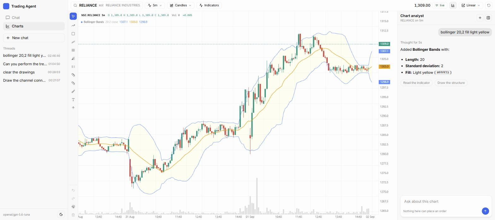

# OpenAlgo Trading Agent

Trade Indian markets by typing what you want. Ask for a quote, an option chain, an indicator or
a screen, and tell it to place the order.

Two surfaces. **Chat** answers questions and places orders. **[Charts](#charts)** is a charting
terminal with a technical analyst beside it that draws on the chart you are looking at.

**Every order stops and asks you to approve it before anything reaches your broker.**

Built on [Agno](https://docs.agno.com) with [OpenAlgo](https://docs.openalgo.in) as the broker
connection.

```
You:   Buy 5 shares of TATAMOTORS on NSE at market, CNC.

Agent: [approval card]
       Simulated order (analyze mode)                         place_order
       Symbol TMCV | Action BUY | Exchange NSE | Quantity 5 | Product CNC

       Checked by the server
       Mode analyze | Notional Rs 2,285.25 | LTP Rs 457.05
       Current position 0 | Available funds Rs 99,99,954.04

       [Approve]  [Reject]
```

Nothing is sent until you click Approve. The numbers under "Checked by the server" are fetched by
the backend, not written by the AI, so they are worth trusting even if the reply above them is
wrong.

## Things you can ask it

**Prices and charts**

- What is RELIANCE trading at?
- Show me the market depth for SBIN
- NIFTY and BANKNIFTY quotes side by side
- How has INFY moved over the last 10 days on the 15 minute chart?

**Indicators** - all 127 from OpenAlgo's library

- 14 period RSI for SBIN on the 15 minute chart
- Show me RSI, MACD, ADX and Supertrend for RELIANCE together
- Which of SBIN, TCS, INFY, WIPRO have RSI below 30?
- Where is MACD crossing over on my watchlist?
- Correlation between SBIN and NIFTY over 20 days

**Options**

- Current month NIFTY straddle symbols
- NIFTY option chain for the nearest expiry with Greeks
- What is the ATM call for BANKNIFTY this expiry?
- Margin required for a NIFTY iron condor

**Your account**

- What are my funds?
- Show my open positions and P&L
- What did I trade today?
- My holdings with current value

**Orders** - each one asks you to approve first

- Buy 10 shares of RELIANCE at market, CNC
- Sell 50 SBIN at limit 1085, MIS
- Buy 1 lot of NIFTY 24300 CE
- Modify order 250408001002736 to limit 16.50
- Cancel all open orders
- Square off all positions

It knows OpenAlgo's symbol format, so "NIFTY 50" and "BANK NIFTY" resolve to the right
instruments, and it looks option symbols up rather than guessing them.

## Charts

`/charts` is a charting terminal with an analyst beside it. Ask in plain words and it works on the
chart in front of you.

<p align="center">
  
</p>

That chart came from one line of typing. The analyst read the symbol and the timeframe off the
screen, resolved "light yellow" to a colour the engine can paint, and said which one it used.

**It already knows what you are looking at.** The symbol, exchange, interval and visible range
travel with every question, so there is nothing to repeat.

- Draw the channel connecting the visible highs and lows
- Add supertrend 3,10
- Bollinger 20,2 fill light yellow
- What is the trend and momentum
- Mark the support and resistance
- Switch to the 15 minute
- Project a target from that channel

```
You:   Draw the channel connecting the visible highs and lows

       [two lines appear on the chart before a word is written]

Agent: NIFTY - NSE, 1h
       Upper rail  Rs 24,908.61 to Rs 24,222.22 across 5 swing highs
       Lower rail  Rs 23,954.60 to Rs 24,076.85 across 3 swing lows
       Structure   Contracting channel, right-edge width Rs 145.37

       [Project a target]  [Clear the markup]
```

**The analyst does not decide where a line goes.** Swing pivots, slopes and levels are computed
from the candles in Python and handed back as exact anchors. The model chooses what to draw and
writes the caption around numbers it was given. It is the same rule the approval card follows,
and for the same reason: a model reading 200 bars of OHLCV and inventing a swing high would look
convincing and be wrong.

**Nothing on this page can reach a broker.** The order tools are not registered for it at all, and
the market data relay refuses the account order stream outright. Trading stays on the chat page,
behind the approval gate.

The chart is [openalgo-charts](https://www.npmjs.com/package/openalgo-charts): 102 indicators, 51
drawing tools and 13 chart types, all of which you can drive by hand as well as by prompt. Live
candles arrive over a websocket.

**Colours are words.** Every colour setting on every indicator takes a name (`yellow`, `crimson`,
`light blue`) or a hex value, and a name the engine cannot paint is refused with the list of ones
it knows rather than passed through to paint nothing. "Fill" and "shade" reach whichever setting
that indicator actually shades with. One indicator needed help: the library's own Bollinger Bands
declares no fill at all, unlike every other band indicator, so this app registers one that does.

Your OpenAlgo API key never reaches the browser. History and ticks both come through the backend,
which injects the key server-side and strips any the page tries to send.

## Safety

**Analyzer mode is the default.** OpenAlgo simulates orders until you deliberately switch it off,
and `REQUIRE_ANALYZER_MODE=true` refuses live orders even then. You have to mean it.

Four independent layers, because only the lower two really hold:

| Layer | What it does | What defeats it |
|---|---|---|
| 1. Instructions | Tells the AI the rules | Any AI mistake. Assume it fails |
| 2. Tool scoping | With trading off, order tools do not exist for the AI at all | Nothing the AI does |
| 3. Your approval | Every order pauses for a click | Approving without reading |
| 4. RiskGuard | Deterministic checks after approval, before the broker | Only a config change |

RiskGuard refuses, in order: the kill switch, `TRADING_ENABLED`, live mode, denylisted symbols,
exchanges outside your allowlist, index symbols (which cannot be traded), products outside your
allowlist, bad quantities, your per-session order cap, **duplicate orders within 10 seconds**, a
**fat-finger guard on any limit price more than 20 percent from the last traded price**, and
affordability.

### What "affordability" means, and why there is no rupee cap by default

The size check is **account-relative**, not a fixed number. No absolute rupee cap suits every
account: one that suits a retail trader blocks a desk punching 5 crore, and one that suits the
desk protects nobody.

So the default guard is `MAX_ORDER_PCT_OF_FUNDS` (90): refuse an order whose **required margin**
exceeds that share of available funds.

Margin is the right measure, not notional. Two NIFTY futures lots are **31.8 lakh of exposure but
only 3.6 lakh of margin** - and it is the margin that has to be in the account. Capping on
notional rejected every derivatives order ever placed, because one lot of any index instrument
exceeds any cash-sized limit.

Absolute ceilings still exist and are **off by default** (`0` = no limit). Set them only if you
want a hard stop on top:

| Setting | Caps |
|---|---|
| `MAX_ORDER_PCT_OF_FUNDS` | Required margin as a share of available funds. The default guard |
| `MAX_ORDER_VALUE` | Cash-segment notional, where notional is the real outlay |
| `MAX_DERIVATIVE_ORDER_VALUE` | F&O exposure, which is far larger than the margin paid |
| `MAX_ORDER_QUANTITY` | Raw quantity |

The affordability check **fails open** if the margin or funds endpoint is unavailable. Refusing
real orders because an endpoint hiccuped is worse than allowing one that has already passed every
other guard and been approved by a human.

Every order is written to an audit trail twice, before the broker is touched and after, in
`data/audit/orders-YYYY-MM-DD.jsonl` and a SQLite table. That is the record of what happened and
why.

**Stop everything instantly**, without restarting anything:

```bash
touch data/KILL
```

Every order tool refuses while that file exists.

## Setup

You need Python 3.14, Node 18+, and **OpenAlgo already running with your broker logged in**.

```bash
git clone https://github.com/marketcalls/TradingAgent
cd TradingAgent

cp .env.example .env

pip install -r backend/requirements.txt
cd frontend && npm install && cd ..
```

Two keys go in `.env`:

| Key | Where it comes from |
|---|---|
| `OPENALGO_API_KEY` | The OpenAlgo web app, after logging in with your broker |
| `LITELLM_API_KEY` | Your AI provider. Leave empty to run a local model with Ollama |

Everything else has a working default. `.env` is gitignored, so your keys stay local.

## Run

```bash
# terminal 1 - backend
cd backend
python -m uvicorn app.main:app --port 8088

# terminal 2 - frontend
cd frontend
npm run dev
```

Open **http://localhost:5173** for chat, or **http://localhost:5173/charts** for the chart.

Use `localhost`, not `127.0.0.1`: Vite binds the hostname only, so `http://127.0.0.1:5173` is
refused even while the server is up.

### Before you place anything

1. The banner at the top should read **ANALYZE**, meaning orders are simulated.
2. Ask it "what are my funds?" - if that works, the broker connection is good.
3. Order tools are **off by default**. To use them, set `TRADING_ENABLED=true` in `.env` and
   restart the backend. Keep `REQUIRE_ANALYZER_MODE=true` until you genuinely intend to trade
   real money.

## If something is not working

| What you see | What it means |
|---|---|
| "I do not have an order-placement tool" | `TRADING_ENABLED=false`. Set it true and restart the backend |
| Every answer fails | OpenAlgo is not running, or the API key is wrong. Run `curl http://127.0.0.1:8088/api/health` and look for `openalgo_connected: true` |
| The page will not load | You used `127.0.0.1:5173`. Use `localhost:5173` |
| A change to `.env` did nothing | The backend reads `.env` once at startup. Restart it |
| "No order was placed" warning under a reply | The AI described an order without actually submitting it. Ask again |
| Symbol not found | Ask it to search, for example "find the symbol for Tata Motors". Names change; `TATAMOTORS` became `TMCV` after the demerger |
| It refuses your order | Read the reason. RiskGuard names the exact limit it hit |

## The stack

### Backend

| Piece | Version | What it does |
|---|---|---|
| [Agno](https://docs.agno.com) | 2.8.7 | Agent loop, tool calling, the approval gate, session storage |
| [LiteLLM](https://docs.litellm.ai) | 1.96.2 | Model routing to any provider |
| [OpenAlgo SDK](https://docs.openalgo.in) | 2.0.3 | Broker connection, REST on `127.0.0.1:5000` |
| FastAPI | 0.141+ | HTTP API and SSE streaming |
| Uvicorn | 0.52+ | ASGI server |
| OpenAlgo `ta` | bundled | 127 indicators, Rust-backed |
| pandas / numpy | 3.0+ / 2.5+ | Candle handling for indicators |
| SQLAlchemy / Pydantic | 2.0+ / 2.13+ | Agno storage, request models |
| SQLite | stdlib | Sessions, paused orders awaiting approval, audit trail |
| Python | 3.14 | |

Agno, LiteLLM and the OpenAlgo SDK are pinned exactly, because an upgrade to any of them can move
the approval gate, the provider workarounds, or the indicator surface. The rest track current
releases.

### Frontend

| Piece | Version | Notes |
|---|---|---|
| React | 19.2 | |
| TypeScript | 7.0 | The native compiler |
| Vite | 8.2 | |
| Tailwind CSS | 4.3 | CSS-first: the theme lives in `@theme` in `src/index.css`, and there is no `tailwind.config.js` or PostCSS step |
| react-markdown + remark-gfm | 10.1 / 4.0 | GFM tables, which most answers use |
| lucide-react | 1.31 | Icons for UI chrome |
| [openalgo-charts](https://www.npmjs.com/package/openalgo-charts) | 1.9.2 | The chart engine. Zero runtime dependencies, lazy tiers, canvas only: it ships no DOM, so every picker and dialog around it is this app's |

### Models

Any LiteLLM provider: Baseten, OpenAI, Anthropic, Gemini, Groq, OpenRouter, or a local model
through Ollama with no API key. See [docs/model-notes.md](docs/model-notes.md).

**43 tools** across 8 toolkits, covering 43 of OpenAlgo's endpoints. 13 of them can move money,
and all 13 require your approval. The charts page adds a ninth toolkit of 14 chart tools, scoped
so they exist only when a chart is open, and not one of them can place an order.

## Validate

```bash
python scripts/validate_setup.py            # broker, model and approval gate
python backend/tests/test_client_layer.py
python backend/tests/test_safety.py         # every RiskGuard limit
python backend/tests/test_registry.py       # all 127 indicators
python backend/tests/test_tools_readonly.py
python backend/tests/test_indicators.py
python backend/tests/test_tools_orders.py
python backend/tests/test_confirm_loop.py   # full approval round trip over HTTP
python backend/tests/test_hitl_models.py    # the approval gate on every model
python backend/tests/test_geometry.py       # swing pivots, channels, levels
python backend/tests/test_tools_charts.py   # the chart tools, none of them gated
python backend/tests/test_openalgo_proxy.py # the candle proxy and the tick relay
python backend/tests/test_chart_wiring.py   # chart context, tool scoping, off-loop broker calls
python backend/tests/test_colours.py        # the colour vocabulary
python backend/tests/test_catalogue.py      # the generated indicator catalogue
```

The order tests refuse to run unless OpenAlgo reports analyzer mode, so they never place a real
order.

## Layout

```
backend/app/
  version.py          the single source of truth for the version
  config.py           settings and logging
  agent.py            model wiring, instructions, per-run tool scoping
  main.py             FastAPI, SSE streaming, the approval loop, sessions
  openalgo/           broker client, response handling, symbols, candle cache
  indicators/         127-indicator registry and dispatcher
  safety/             RiskGuard and the audit trail
  tools/              9 toolkits, 57 tools
  charts/             the drawing contract, swing geometry, indicator catalogue
  routes/             the OpenAlgo proxy: candles over REST, ticks over a socket
frontend/src/
  components/         Sidebar, ModeBanner, Message, ToolTimeline,
                      ConfirmCard, DataTable, Composer, ThinkingSelector
  components/charts/  toolbar, drawing rail, indicator dialogs, analyst panel
  lib/charts/         the chart terminal, its feed, theme and annotations
  pages/              ChartsPage
docs/
  CHANGELOG.md        what changed, per version
  model-notes.md      choosing a model, and the provider bugs worked around
  plan/PLAN.md        the design document
  progress/           what was built and validated, per iteration
```

## Documentation

- **[docs/model-notes.md](docs/model-notes.md)** - choosing a model, thinking control, and the
  provider bugs the agent works around automatically.
- **[docs/CHANGELOG.md](docs/CHANGELOG.md)** - what changed in each version.
- **[docs/plan/PLAN.md](docs/plan/PLAN.md)** - the design document.
- **[docs/plan/PLAN-charts.md](docs/plan/PLAN-charts.md)** - the charts page and the analyst,
  including what was measured about the chart engine before any of it was built.
- **[docs/progress/](docs/progress/)** - each build iteration with its real validation output.

## Version

Maintained in `backend/app/version.py` as the single source of truth, and served on
`GET /api/health`.

## Not investment advice

This software carries out your instructions and shows you data. It does not give investment
advice and will not tell you what to buy or sell. Trading carries risk of loss. You are
responsible for every order you approve.

## Licence

MIT - see [LICENSE](LICENSE).
